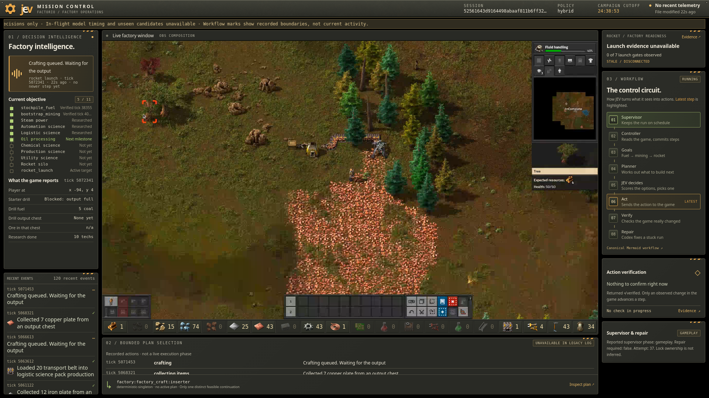
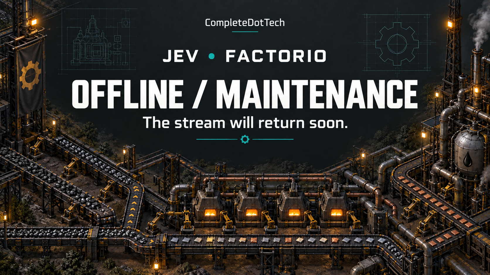

# JEV Factorio Mission Control: OBS overlay

The live broadcast overlay for the JEV AI Factorio stream, captured exactly as
deployed and traced back to its source. The current deployment is jev-factorio-agent
[`6424661`](https://github.com/CompleteDotTech/jev-factorio-agent/commit/6424661),
which has been live since 2026-09-26 23:43Z.



*The full program output as streamed (scene **JEV Mission Control**, 1920x1080),
captured from OBS on 2026-09-26 23:43Z while running `6424661`. The
game video fills the center OBS COMPOSITION area and the overlay surrounds it.
The **Current objective** tree on the left counts milestones toward a first
rocket launch: the controller's verified goals plus the research milestones
seen along the way.*

The offline / maintenance slate:



## Where it came from

| Layer | Location on the live system | In this repo |
| --- | --- | --- |
| Overlay web app (package `jev_factorio/`) | `obs-production` VM, `/opt/jev-mission-control/jev_factorio/` | `obs-production/opt/jev-mission-control/jev_factorio/` |
| Item icons (`--icon-dir`) | `/opt/jev-mission-control/icons/`, copied from Factorio 1.1.110 `data/base/graphics/icons` | **Not included**: these are Wube game assets |
| Overlay service (`127.0.0.1:8765`) | `/etc/systemd/system/jev-mission-control.service` | `obs-production/etc/systemd/system/` |
| OBS scene collection `STS2`, scene **JEV Mission Control** | `~ubuntu/.config/obs-studio/basic/scenes/STS2.json` | `obs-production/home/ubuntu/.config/...` (SRT passphrases redacted) |
| OBS Lua scripts, media sources, relay, maintenance art | `~ubuntu/jev-obs/` | `obs-production/home/ubuntu/jev-obs/` |
| Telemetry mirror (controller to OBS VM, every 3 s) | Train host, `~completetrain/factorio-controller-replacement/` + user systemd unit | `train/` |
| Generated art | see above | [`art/`](art/) |

The OBS browser source loads `http://127.0.0.1:8765/?studio=1&v=d02486c`.
OBS draws that page over the native game video source, which sits under the
transparent **OBS COMPOSITION** area. After a deploy, reload the page with the
source's **Refresh** button in OBS. The server sends `no-store`, but a page that is
already running keeps its old scripts until it reloads.

### Source commit

**Current, from 2026-09-26 23:43Z:** `jev_factorio/` is an exact copy of
`src/jev_factorio/{__init__,dashboard,dashboard_mission}.py` and `dashboard_assets/`
at [`6424661`](https://github.com/CompleteDotTech/jev-factorio-agent/commit/6424661).
It adds two PRs to `16ab385`:

- PR #104: the objective tree shows 11 milestones instead of three fixed goals.
  The controller's goals keep their verified ticks. Base-game research on the way
  to the rocket (steam power, the science packs, oil processing, the rocket silo)
  shows the tick it was first seen. Research already done when the dashboard
  started watching shows as "Researched", with no tick.
- PR #105: milestone names never clip in the OBS browser source.

`jev_factorio/DEPLOYED_COMMIT` records the deployed commit on the VM. The unit
runs `python3 -m jev_factorio.dashboard ... --icon-dir /opt/jev-mission-control/icons`.
Each deploy's rollback copy is in `theme-backups/`:
`20260926T234310Z-pre-6424661/` (`c454af6`, PR #104 only, live 23:37Z to 23:43Z),
`20260926T233716Z-pre-c454af6/` (`16ab385`, live 12:10Z to 23:37Z), and
`20260926T120921Z-pre-16ab385/`.

**`16ab385`, 2026-09-26 12:10Z to 23:37Z:** added PR #86 (item icons,
plain-language events, a pending-check indicator, and clearer observations and
workflow) and PR #88 (a one-line readiness panel in the studio layout).

**Previous, 2026-09-23 to 2026-09-26:** the flat `dashboard.py` and
`dashboard_assets/` at the top of `/opt/jev-mission-control/` are still on disk
but no longer served. The rest of this section describes that version.

The overlay app is built from
[`CompleteDotTech/jev-factorio-agent`](https://github.com/CompleteDotTech/jev-factorio-agent)
(`src/jev_factorio/dashboard.py` and `dashboard_assets/`). Each deployed file
was hashed and matched to that repo's history:

- `dashboard.py`, `app.js`, `index.html` and `factory-steel.png` are
  byte-identical to commit
  [`d02486c`](https://github.com/CompleteDotTech/jev-factorio-agent/commit/d02486c3612381927bd77c443c49f3bd8d3f5231)
  ("Hide scrollbar chrome in OBS dashboard compositions", 2026-09-23).
- `styles.css` has the same rules as `d02486c`, but the scrollbar-hiding block
  is appended at the end of the file instead of sitting mid-file. It was
  hot-patched before that commit.
- `*.before-studio-*` and `theme-backups/` are the deployment's own rollback
  copies. They match earlier upstream commits: PR #25 `ba9d71a`, `1545b62`,
  `b3cd8a6` and `00b1c97`.
- `mission_control.py` and `mission_control_web/` are the original PR #25
  Mission Control app. They are still on disk but no longer serve the stream.

The previous deployment did not include PR #68's launch-readiness panel or
`mission.js`/`mission.css`. Every deployment since `16ab385` does.

## Data flow

```
herdr-vm: podman session-home-complete-tech
  /workspace/jev-factorio-agent/.../runs/controller-production-*/{gameplay.jsonl,supervisor.json}
      |  (Train: factorio-production-telemetry.service, read-only, QEMU guest agent)
      v
obs-production VM: /var/lib/jev-mission-control/{gameplay.jsonl,supervisor.json}
      |  (jev-mission-control.service -> python3 -m jev_factorio.dashboard :8765)
      v
OBS browser source "JEV Mission Control UI" -> Twitch
```

The dashboard is read-only. It redacts credential-like keys and values before
rendering, and it doesn't call models or control the game.

## Running the overlay locally

```
cd obs-production/opt/jev-mission-control
python3 -m jev_factorio.dashboard \
  --log-file gameplay.jsonl --supervisor-state supervisor.json --port 8765 \
  [--icon-dir /path/to/Factorio/data/base/graphics/icons]
```

Without `--icon-dir`, inventory slots and events show item names instead of icons.

Open `http://127.0.0.1:8765/?studio=1` (1920x1080 studio layout) or `/?overlay=1`.
A missing log file is fine; the page shows its "awaiting evidence" state.

## Redactions

The SRT listener passphrases in `STS2.json`, `jev-obs/media.json` and
`jev-obs/factorio-b-media.json` are replaced with `REDACTED`. None of these files
contains a stream key or Twitch token. The relay and metadata scripts read those
at runtime from the live OBS profile and browser cookie store. Recordings,
runtime status files and backups of the OBS profile are not included. The only
screenshot is the program-output capture shown at the top of this README.

Factorio is a trademark of Wube Software. This project isn't affiliated with Wube.
