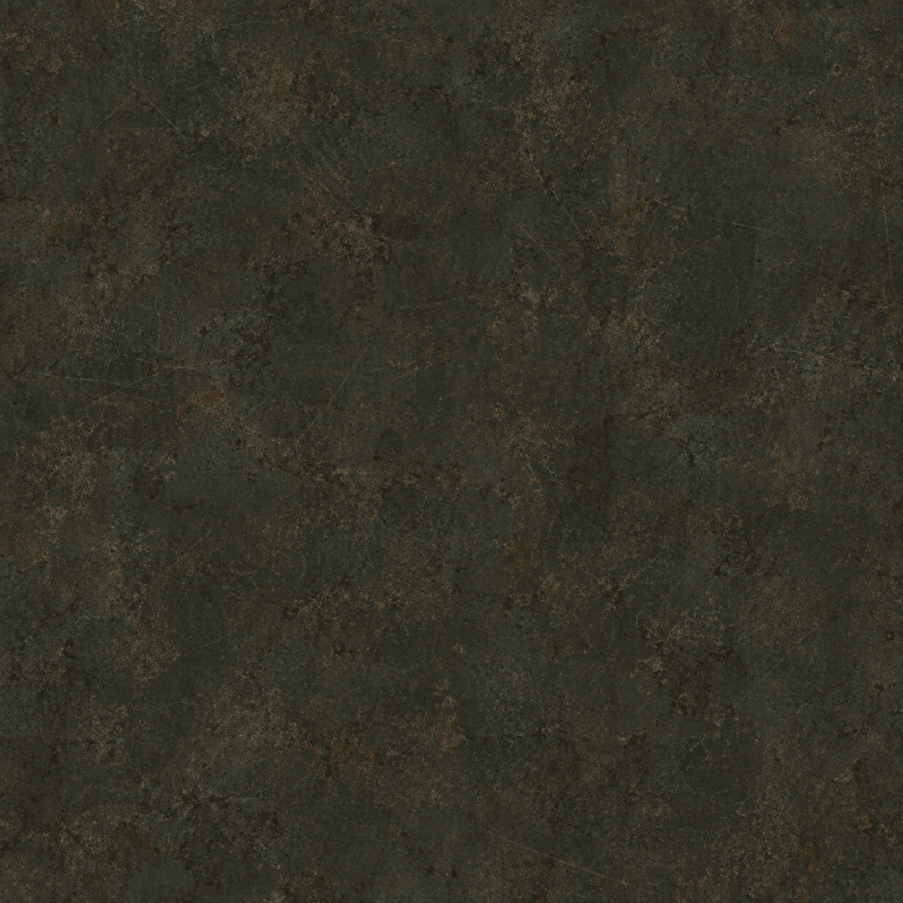

# Art

`factory-steel.png` and `jev-factorio-maintenance-v1.png` are AI-generated and used
as-is, with no edits. `jev-mission-control-overlay-live.png` is a screenshot, not
generated art.

## `factory-steel.png`

1254x1254 background texture for the Mission Control header and page. The page
covers it with a 92%-opaque dark tint, so data panels stay readable. Deployed at
`/opt/jev-mission-control/dashboard_assets/factory-steel.png`.

Generated with the built-in GPT image tool on 2026-09-21. Prompt, from upstream
`docs/DASHBOARD_ART.md`:

> Use case: stylized-concept. Asset type: subtle industrial texture for a Factorio-inspired live factory monitoring dashboard, not a dashboard mockup. Generate one square 1024x1024 flat, orthographic, edge-to-edge swatch of very dark charcoal, slightly olive-grey, worn painted steel. Restrained fine scratches, faint soot and extremely subtle aged metal grain; a hint of warm copper oxidation. Entire image has evenly distributed low contrast and no focal point, lighting is flat and diffuse, designed to repeat as a quiet background texture. Main palette near #292a25, darkest near #20221d, brightest below #494a3f. No objects, gears, pipes, bolts, frames, stripes, symbols, text, letters, logos, watermarks, numbers, UI, gradients to white, bright highlights or perspective. This will sit beneath an opaque-dark translucent tint so actual HTML text remains easy to read.

## `jev-factorio-maintenance-v1.png`

1672x941 "OFFLINE / MAINTENANCE" slate, dated 2026-09-24. It is shown by the OBS
scene **JEV - Maintenance** (image source "JEV Maintenance Image", driven by
`obs-maintenance-scene.lua`). Deployed at `~ubuntu/jev-obs/assets/`.
AI-generated; the generation prompt was not recorded with the file.

## `jev-mission-control-overlay-live.png`

1920x1080 screenshot of the live OBS program output (scene **JEV Mission Control**)
on 2026-09-26, while `16ab385` was deployed. It was taken with the
`screenshot.request` trigger in `jev-factorio.lua`, which calls
`obs_frontend_take_screenshot()`. OBS saved the original to
`/mnt/recordings/sts2/program/`. The game footage in it is Factorio (Wube Software).
